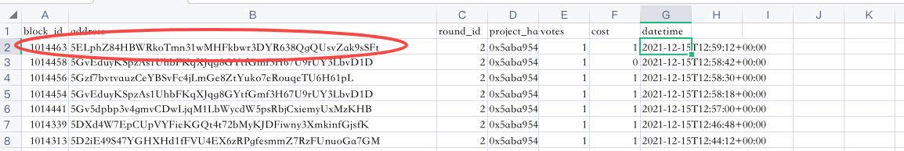
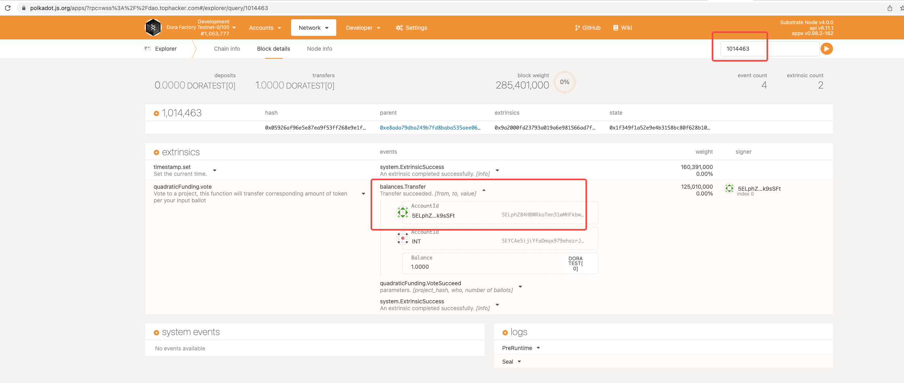

# Dora Factory Community Grant Round 2 Pallet Bug & Voting Data Recovery Report

This round is the first time to use a Substrate blockchain to run a real quadratic funding round and fund blockchain ecosystem public goods (in this case, within the Dora Factory ecosystem). We built a quadratic funding pallet (early 2021) to serve as the backend of the voting mechanism. Source code can be found here: https://github.com/DoraFactory/Quadratic-Funding-Grant-Pallet.

After the round a bug was found in the pallet that could lead to unlimited votes from any account that has `balance>0`. And indeed the bug was exploited, especially during the final days of the round.

## Root cause

We use the [transfer functions](https://docs.rs/pallet-balances/3.0.0/src/pallet_balances/lib.rs.html#255-264) to collect tokens from voter, but missing `?` at the end.
```
let _ = T::Currency::transfer(&who, &Self::account_id(), Self::u128_to_balance(amount), KeepAlive);
```
Under this condition, when voter has insufficient balance, the function execution will not terminate and throw an error like expected. Below is the fix:
```
let _ = T::Currency::transfer(&who, &Self::account_id(), Self::u128_to_balance(amount), KeepAlive)?;
```

## Valid Votes and On-chain Data Filtering

A valid vote triggers 3 events in sequence. 

`balances.Transfer`->`quadraticFunding.VoteSucceed`->`system.ExtrinsicSuccess`. 

An invalid vote, as we described above, will NOT emit  `balances.Transfer`. We can use this feature to distinguish valid votes and invalid votes.

## Data Recovery

We use [harvester](https://github.com/polkascan/polkascan-pre-harvester) to collect and parse all blocks on chain. The structured information will be stored in a central RDBMS(MySQL, PostgreSQL etc.). Then we can filter all the vote extrinsics and its relevant events. To make this easier, we wrote a simple python program to do this. To ensure the correctnees of the data, we made a double check using [polkadot.js](https://polkadot.js.org/apps/?rpc=wss%3A%2F%2Fdao.tophacker.com#/explorer). For example, we pick the `block_id` from arbitrary row and query it in polkadot.js. 


We can see that the address, block hash, extrinsics hash and adress are the same.
The python code is attached below.
```import json
import urllib.request
import csv
from pathlib import Path
from decimal import Decimal


def get_trans_detail(trans_hash):
    if not hash:
        print('Hash can not be empty!')
        return
    url = f'http://47.242.49.109:8003//extrinsic/0x{trans_hash}?include=events'
    req = urllib.request.urlopen(url)
    result = req.read().decode('utf-8')
    return json.loads(result)


def get_trans_by_page(page):
    url = 'http://47.242.49.109:8003//extrinsic?' \
          'filter[signed]=1&filter[module_id]=QuadraticFunding&filter[call_id]=vote' \
          '&page[number]='+str(page)+'&page[size]=100'
    req = urllib.request.urlopen(url)
    result = req.read().decode('utf-8')
    data = json.loads(result).get('data')
    # page overflow
    if not data:
        return False
    projects = {}
    for d in data:
        # print(props['block_id'],props['extrinsic_hash'])
        detail = get_trans_detail(d['attributes']['extrinsic_hash'])
        props = detail['data']['attributes']
        events = detail['included']
        cost = events[0]['attributes']['attributes'][-1]['value'] / 1000000000000 if len(events) == 3 else 0
        project = {
            'block_id': props['block_id'],
            'address': props['address'],
            'round_id': props['params'][0]['value'],
            'project_hash': props['params'][1]['value'],
            'votes': props['params'][2]['value'],
            'cost': f'{cost}',
            'datetime': props['datetime'],
        }
        # 提取项目的 buidl id
        project_id = int(project['project_hash'][22:26], 16)
        if project_id not in projects:
            projects[project_id] = []
        projects[project_id].append(project)

    csv_header = ['block_id', 'address', 'round_id', 'project_hash', 'votes', 'cost', 'datetime']
    for k, v in projects.items():
        filename = f'{k}.csv'
        is_new = not Path(filename).exists()
        with open(filename, 'a') as csvfile:
            writer = csv.DictWriter(csvfile, fieldnames=csv_header)
            if is_new:
                writer.writeheader()
            writer.writerows(v)
    return True


def parse_and_filter(skip=False):
    pids = {
        1233: {
            'name': 'ShowMe',
            'total_votes': 0,
            'grants': Decimal(0),
            'area': Decimal(0)
        },
        1169: {
            'name': 'EntangledQuery',
            'total_votes': 0,
            'grants': Decimal(0),
            'area': Decimal(0)
        },
        1759: {
            'name': 'Viva la Vida',
            'total_votes': 0,
            'grants': Decimal(0),
            'area': Decimal(0)
        },
        1082: {
            'name': 'DAOrayaki',
            'total_votes': 0,
            'grants': Decimal(0),
            'area': Decimal(0)
        },
        1569: {
            'name': 'TIBs',
            'total_votes': 0,
            'grants': Decimal(0),
            'area': Decimal(0)
        },
        1739: {
            'name': 'SeeDAO',
            'total_votes': 0,
            'grants': Decimal(0),
            'area': Decimal(0)
        },
        1728: {
            'name': 'DF Moloch',
            'total_votes': 0,
            'grants': Decimal(0),
            'area': Decimal(0)
        },
        1726: {
            'name': 'Substrate Multisig',
            'total_votes': 0,
            'grants': Decimal(0),
            'area': Decimal(0)
        },
        1696: {
            'name': 'SnapfingersDAO',
            'total_votes': 0,
            'grants': Decimal(0),
            'area': Decimal(0)
        },
        1684: {
            'name': 'Aletheia',
            'total_votes': 0,
            'grants': Decimal(0),
            'area': Decimal(0)
        },
        1679: {
            'name': 'HackathonDAO',
            'total_votes': 0,
            'grants': Decimal(0),
            'area': Decimal(0)
        },
    }
    rnd = {
        'area': Decimal(0)
    }
    voted_map = {}
    for k in pids.keys():
        all_rows = []
        with open(f'{k}.csv', newline='') as csvfile:
            reader = csv.DictReader(csvfile)
            for r in reader:
                if skip and Decimal(r['cost']) == 0:
                    continue
                all_rows.insert(0, r)
        for row in all_rows:
            votes = int(row['votes'])
            voted_key = str(k) + row['address']
            voted = voted_map.get(voted_key, 0)
            cost = Decimal(votes * (votes + 1)) / Decimal(2) + Decimal(voted * votes)
            voted_map[voted_key] = voted + votes
            area = votes * (pids[k]['total_votes'] - voted)
            pids[k]['area'] += area
            pids[k]['grants'] += cost
            pids[k]['total_votes'] += votes
            rnd['area'] += area
    for k in pids.keys():
        pids[k]['matching'] = pids[k]['area'] / rnd['area'] * Decimal(7520)
    for t in sorted(pids.items(), key=lambda item: item[1]['matching'], reverse=True):
        name = t[1]['name']
        total_votes = t[1]['total_votes']
        grants = round(t[1]['grants']*Decimal(0.94), 2)
        matching = round(t[1]['matching'], 2)
        print(name, total_votes, grants, matching, sep=',')


def collect_all():
    # max votes is 921
    for i in range(1, 10):
        print(f'Start to handle page {i}')
        r = get_trans_by_page(i)
        print(f'Page result {str(r)}')
        if not r:
            break
    print('data collect done')


if __name__ == '__main__':
    collect_all()
    parse_and_filter(True)


```
The first function in `main` is to collect all structured information from all testnet blocks and store them into separte csv files. The second one is to analyze the voting data and emulate the real quadratic funding logics on chain. Also, for accuracy, we added a flag here, if it passes the `skip` with False, you'll see ranking result just exactly like before. Only when `skip` is True, the ranking is correct. Anyone can run this script, make sure python version >= 3.9

## Attachments
1. [csv files generated](csv-files/)
2. [Final results](DF-ranking-comparision.xlsx) and a comparison with old reults (before data recovery)

*Please note that all on-chain data is downloaded from the Dora Factory Substrate Testnet[0] network, on which the QF pallet was deployed. The testnet might reboot for later pallet tests and infrastructure developments. The current network will live for at least 30 days after Dec 18, 2021.*
